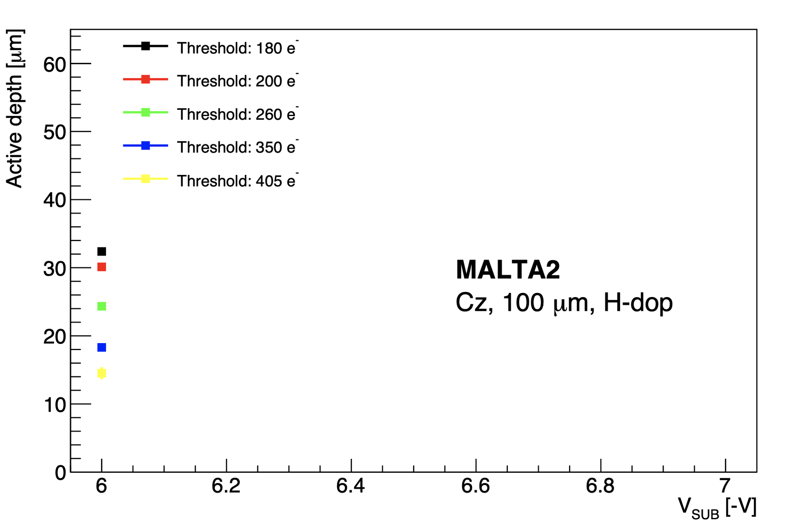

Data taken with the standard MALTA2 parameters: 36.4um pixel pitch, 512 x 224 pixel matrix, 100um sensor thickness, 2ns (RUN_1) and 25ns (RUN_2) integration time. Depletion voltage changed to -60V as Dr. Long Li's unirradiated data suggested based on w_d = k(V_b)\^1/2. (See attached figure for unirradiated data, make sure to use the lowest threshold value.)

| Parameter        | Value                 |
|------------------|-----------------------|
| Sensor Dimension | 20.2 mm x 10.1168 mm  |
| Pixel Pitch      | 36.4 um x 36.4 um     |
| Pixel Matrix     | 512 x 224             |
| Sensor Thickness | 100 um                |
| Sensor Excess    | 0.7816 mm x 0.9812 mm |

: Table of sensor parameters

| Parameter              | Value   |
|------------------------|---------|
| Particle               | proton  |
| Energy                 | 180GeV  |
| Temperature            | 258.15K |
| Depletion Voltage      | -60V    |
| Digitisation Threshold | 260e    |

: Simulation operational parameters

