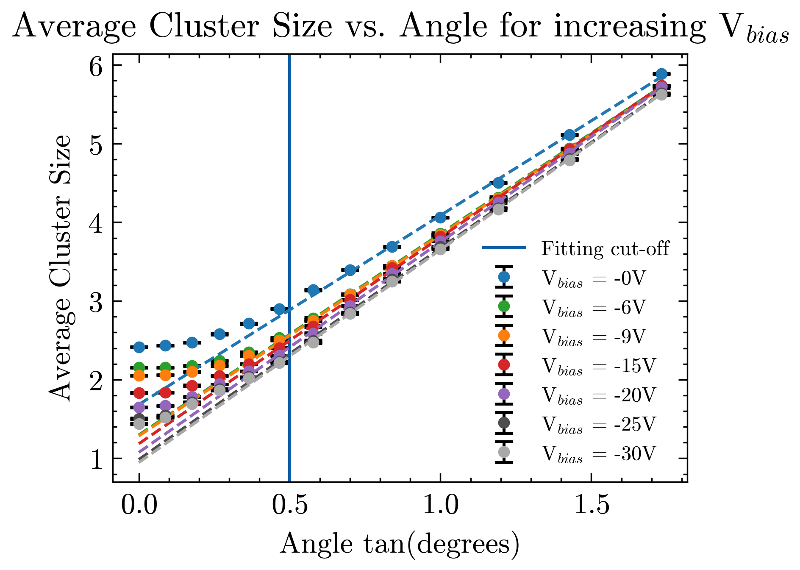
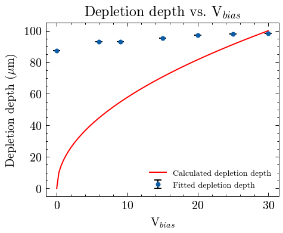

## Set-Up

This data was taken with the MALTA2 DUT to test the effect of different integration timing on the clustering data. Measurements are taken at each bias voltage, up to the full depletion voltage of -30V. The beam size is 10um, the sensor thickness is 100um and the pixel matrix is 512 x 224. Integrated timing information is taken at 25ns. Pixel pitch = 36.4um.

| Parameter        | Value                 |
|------------------|-----------------------|
| Sensor Dimension | 20.2 mm x 10.1168 mm  |
| Pixel Pitch      | 36.4 um x 36.4 um     |
| Pixel Matrix     | 512 x 224             |
| Sensor Thickness | 100 um                |
| Sensor Excess    | 0.7816 mm x 0.9812 mm |

: Table of sensor parameters

| Parameter              | Value   |
|------------------------|---------|
| Particle               | proton  |
| Energy                 | 180GeV  |
| Temperature            | 258.15K |
| Depletion Voltage      | -30V    |
| Digitisation Threshold | 260e    |

: Simulation operational parameters

## Results

