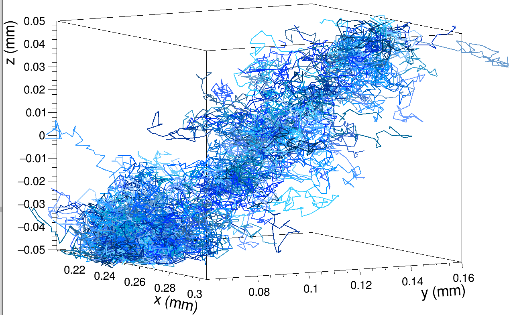
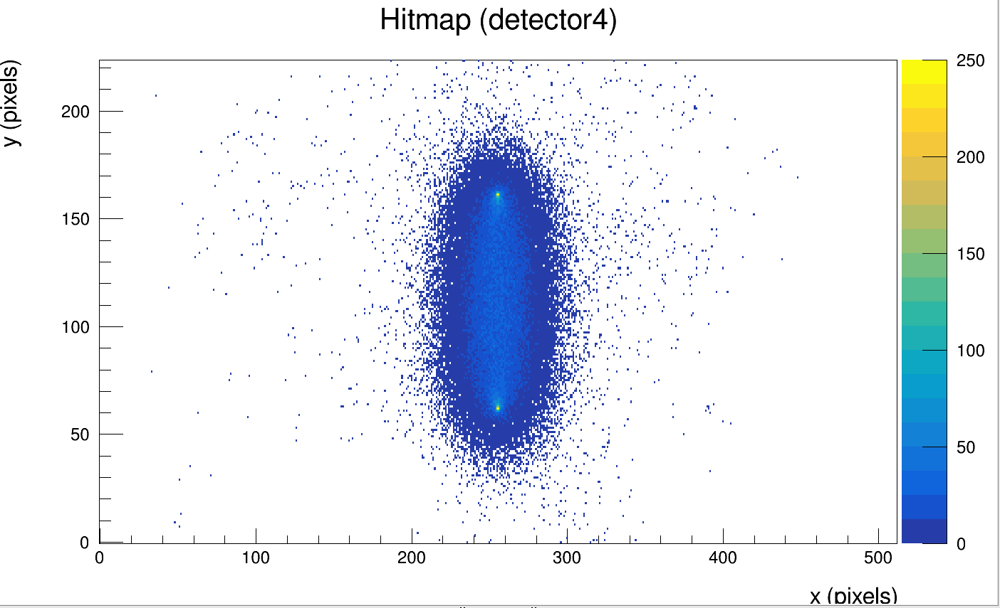
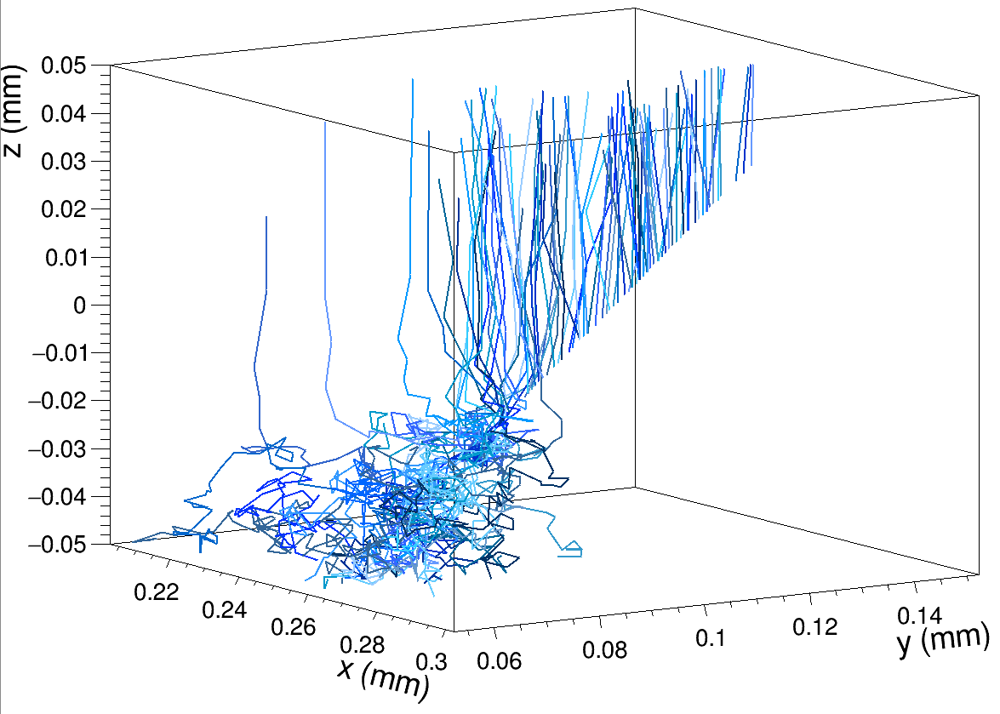
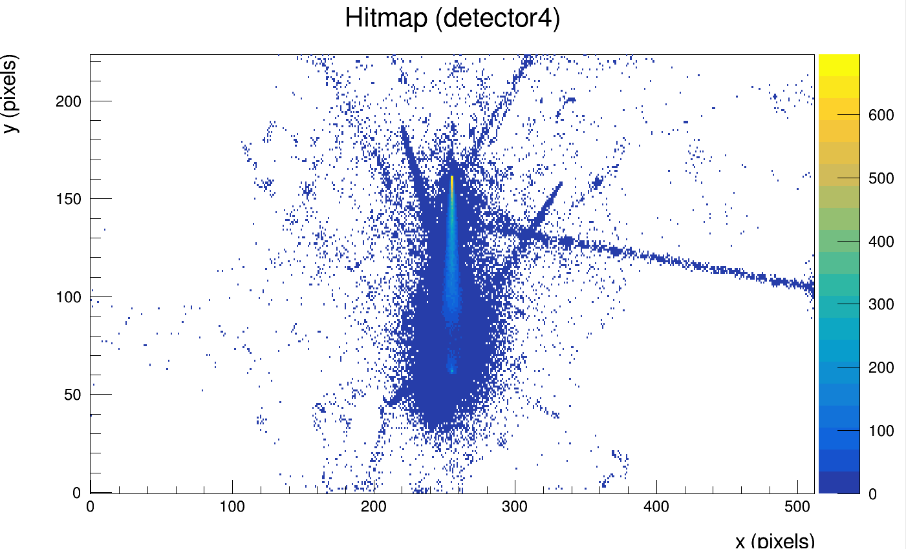
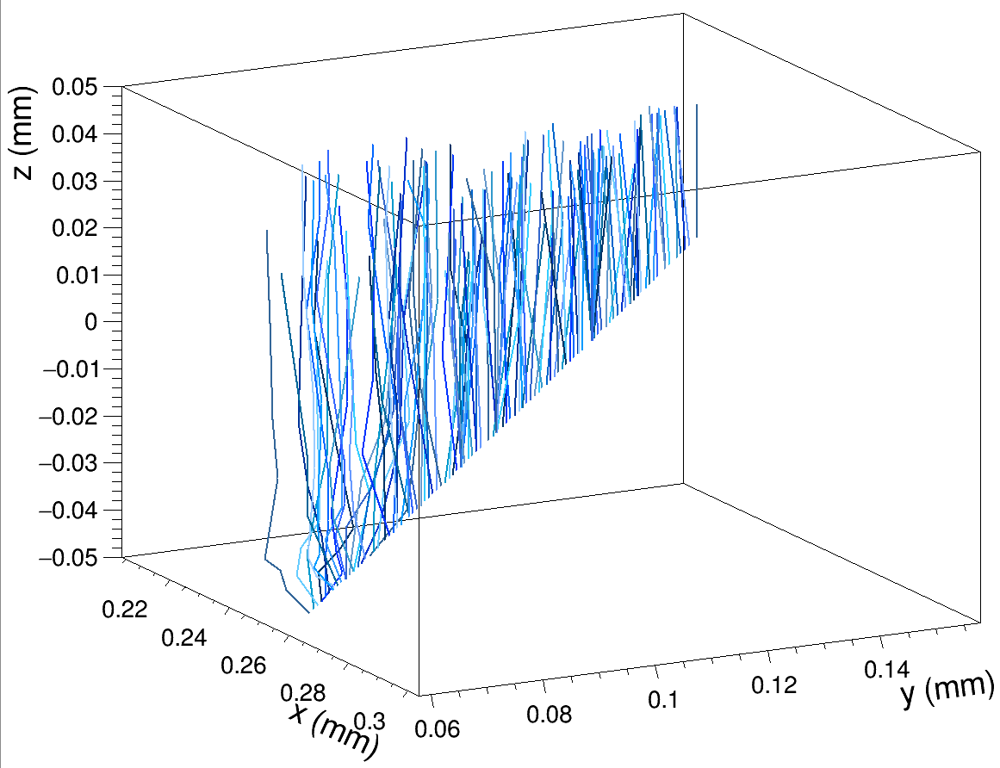
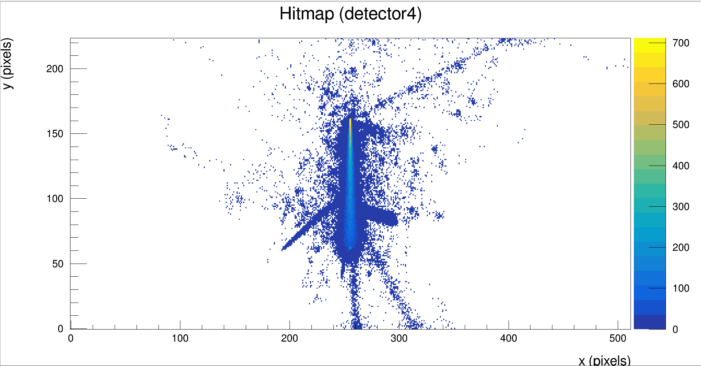
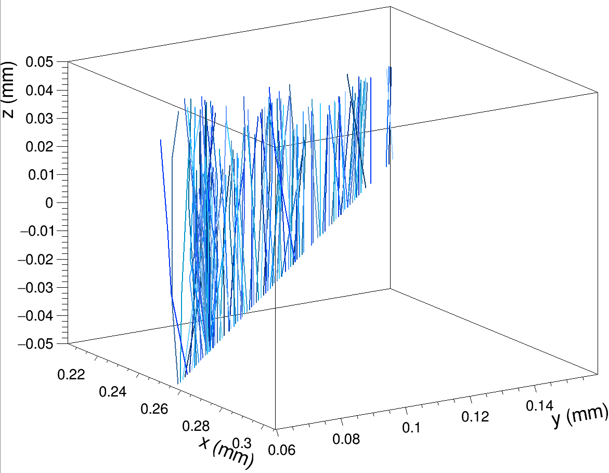
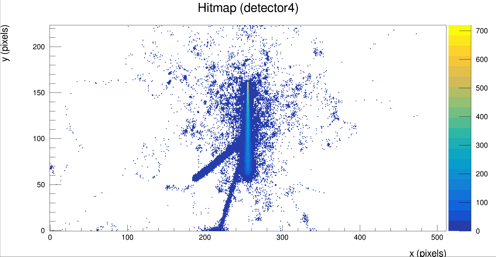

## Set-Up

Data taken for 1 and 10E4 events with a 1um pixel pitch, 512 x 224 pixel matrix for a 10nm beam size and 25ns integration time. This data is included in slides 28 - 32 of the project presentation.

| Parameter        | Value                 |
|------------------|-----------------------|
| Sensor Dimension | 20.2 mm x 10.1168 mm  |
| Pixel Pitch      | 1 um x 1 um           |
| Pixel Matrix     | 512 x 224             |
| Sensor Thickness | 100 um                |
| Sensor Excess    | 0.7816 mm x 0.9812 mm |

: Table of sensor parameters

| Parameter              | Value   |
|------------------------|---------|
| Particle               | proton  |
| Energy                 | 180GeV  |
| Temperature            | 258.15K |
| Depletion Voltage      | -30V    |
| Digitisation Threshold | 260e    |

: Simulation operational parameters

Number of events = [1, 10000]

output linegraphs = [true (for 1 event), false (for 10000 events)]

Bias voltages = [0V, -6V, -9V, -15V, -20V, -25V, -30V, -50V]

## Results

