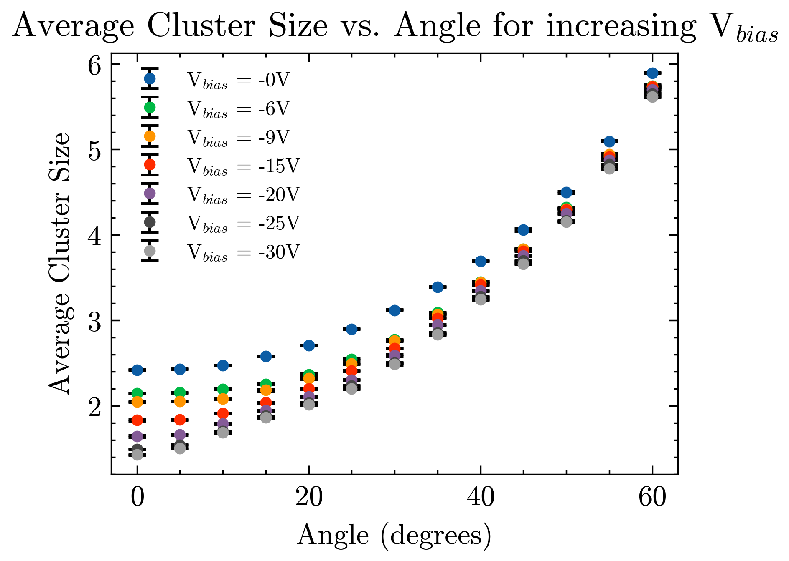
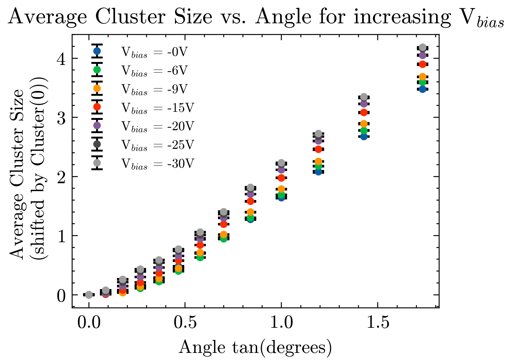
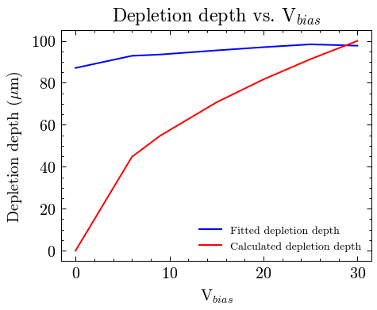
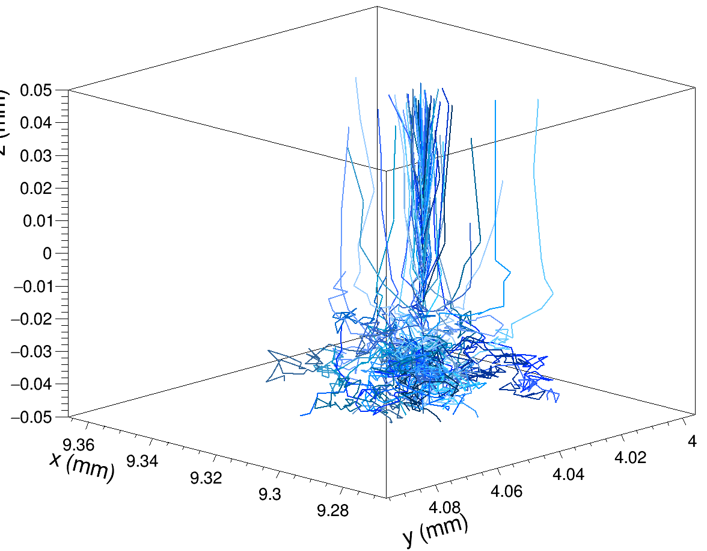
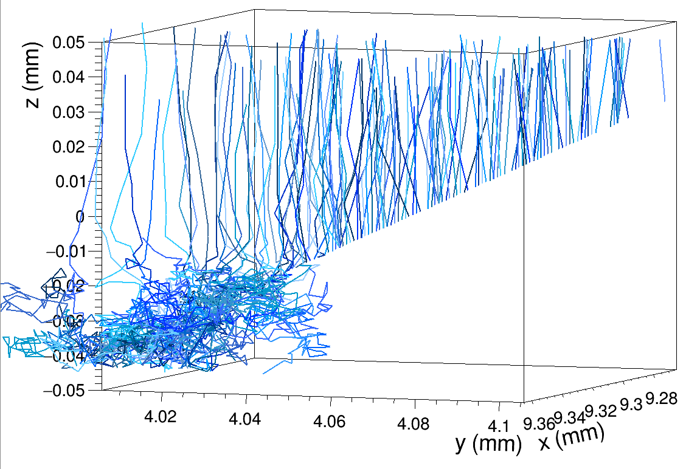

# Constructing a Sentaurus TCAD and Allpix Squared Sensor Simulation

## Introduction:

Included here is a TCAD tutorial using the Sentuarus Workbench (SWB) to simulate a series of increasingly sophisticated semiconductor sensors. Following this is an Allpix Squared tutorial, where a test beam of protons impinges on a telescope of 7 MALTA2 monolithic sensors. An analysis of the mean cluster size against the fourth detector's rotation is conducted and compared with experimentally measured values for an equivalent set-up with irradiated detectors. ***NEED A REFERNCE TO IRRADIATION***

## Constructing an Initial SWB PN Junction:

The TCAD Sentaurus Tutorial can be found at: <file:///scratch/synopsys/sentaurus/V-2024.03/tcad/V-2024.03/Sentaurus_Training/index.html>. I would recommend reading the first module up to Section 6 (Managing Projects) to gain an idea of how to use SWB. Pay particular attention to mentions of Device Simulation, as this what we will use to measure the simulated sensor's electrical properties.

## Constructing a Sensor Test Beam Simulation:

To begin with, we took the **alpide** model from the featured Allpix models and changed the relevant parameters to match those in the table below.

| Parameter        | Value                     |
|------------------|---------------------------|
| Sensor Dimension | 20.2 mm x 10.1168 mm      |
| Pixel Pitch      | 36.4 $\mu$m x 36.4 $\mu$m |
| Pixel Matrix     | 512 x 224                 |
| Sensor Thickness | 100 $\mu$m                |
| Sensor Excess    | 0.7816 mm x 0.9812 mm     |

: Table of sensor parameters

Then we created a detector configuration file, specifying the **alpide** as the detector type, and arranging the 7 detectors/sensors as per the table below. The operational parameters in the table below that represent the conditions used in the experimental equivalent to this Monte Carlo simulation.

| Z-axis position (mm) |
|----------------------|
| 0                    |
| 80                   |
| 160                  |
| 550                  |
| 940                  |
| 1020                 |
| 1100                 |

: Sensor z-axis positions

| Parameter              | Value   |
|------------------------|---------|
| Particle               | Proton  |
| Energy                 | 180GeV  |
| Temperature            | 258.15K |
| Depletion Voltage      | -30V    |
| Digitisation Threshold | 260e    |

: Simulation operational parameters

For the simulation constructed, a linear electric field is used, as per the equation below,

$$
E(z) = \frac{|U_{bias}|-|U_{depl}|}{d}+2\frac{|U_{depl}|}{d}\left(1-\frac{z}{d}\right).
$$

When initialising the simulation, it's worth noting that detector geometries are generated equally in the positive and negative x- and y-axis respectively. This meant that the beam must be initialised in the world origin point solely in the z-axis.

## Automating the Allpix simulation process:

Due to the tedious nature of collecting mean cluster sizes for angles from 0 - 60 degrees in 5 degree increments for each of the bias voltage, it was decided the process should be automated. To do this, a Python was program was created which started by updating the detector configuration file with the correct angle. It then executed the full configuration file, saved the outputted ROOT file, and extracted the mean and standard deviation for the x and y cluster sizes. These steps repeated for 0 - 60 degrees in 5 degree increments, then all the data was saved to a CSV.

## Comparing Cluster Sizes

Once data was taken for V$_{bias}$ = -6V, -9V, -15V, -20V, -25V, and -30V with V$_{depletion}$ = -30V, plots of the average cluster size and depletion depth were made. These plots should show a linear relationship, as per,

$$
Cluster(tan (\alpha)) = \frac{d}{p}(tan(\alpha))+Cluster(0),
$$

where d is the depletion depth and p is the pixel pitch. However, this was not observed for low angles. To investigate this further, a straight line fit is done on the figure for tan(angle) \< 0.5. The gradient of this is multiplied by the pixel pitch to give the depletion depth for each bias voltage, as shown in the figure below. When investigating the first figure, it can be seen that the cluster size at zero degrees decreases with increasing bias voltage.

Once the linear fit is taken for the cluster data, it can be compared

$$
w_d = \sqrt{\frac{2\epsilon(V_b + V_{bi})}{Ne}},
$$

where $V_b$ and $V_{bi}$ are the bias and built-in voltage respectively. For the detector under consideration, it is assumed that $V_b >> V_{bi}$ and therefore

$$
w_d \propto \sqrt{V_b}.
$$

_Cluster_Size.png)

We see in the figure above that the fitted and calculated data do not match for the complete run of bias voltages.

## Investigating Electron-Hole Diffusion

In the previous investigation, we saw that at increasing bias voltages, the cluster size at zero degrees decreases. This suggests that the increasing electric field decreasing the proportion of charge sharing occurring between pixels. To characterise this fully, we must look to the electron-hole diffusion. Allpix has a built-in way to see the electron diffusion in the sensor via line graphs, as in the figures below.

We can see that when the telescope is removed, less scattering occurs before the proton beam enters the DUT. When looking at the hitmap for the full depleted sensor, scratches are observed which correspond to electrons scattered in the sensor material before reaching the collection electrode. These are then minimised when the detector is overbiased at V$_{bias}$ = -50V for the 0 degree measurement, but not for the 60 degree measurement. This therefore explains the decreased 0 degree cluster size as the stronger electric field minimises charge sharing.

## Investigating the effect of diffusion

Due to the scratches seen in the figures above, an investigation was conducted into the effect of diffusion on their size. It was discovered that the width of the depletion region follows

The cut-off for the electric field occurs at $w_d$. For the investigation

| \|V$_{bias}$\| | $$                                   
                                    _{c10nmalculated    
                                    $$                  | Col3 |
|----------------|--------------------------------------|------|
|                |                                      |      |
|                |                                      |      |
|                |                                      |      |
|                |                                      |      |
|                |                                      |      |
|                |                                      |      |

: Table of the bias voltage compared the calculated and actual depletion width.

UNEDITED BELOW:

The main simulation configuration file for this simulation is adapted from example.conf, which can be found here

./allpix-squared/examples

. You will then need to add the following line in the main simulation configuration file [Allpix] header:

model_paths = "./allpix-squared/<detector_files>/"

where <detector_files> is the directory where allpide is stored. This allows Allpix to know where you want it to check for pre-defined detectors. Before running your full simulation .config file, the following line must be added in the [ROOTObjectWriter] header:

file_name = "./allpix-squared/\<Output_File_Name.root\>"

This specifies where you want your output data to be stored. Finally, you'll need to add a [DetectorHistogrammer] header for the fourth detector. Now run your main simulation configuration file. Once this has completed, open a new TBrowser. Your screen should look like this:

To look for histogram data, go to PixelHit/<detector>/pixel/local_center\_/X(). This should demonstrate to you that the simulation was successful as it shows you the pixel hits in the X-axis. (The same logic can be applied to the Y- and Z-axis.) To look at clustering dat

Sentaurus Process can be used for fabrication, while Sentaurus Structure Editor uses pre-def

alma9

source /cvmfs/clicdp.cern.ch/software/allpix-squared/3.1.0/x86_64-el9-gcc12-opt/setup.sh

ined geometries. After a structure is generated, we can create a device to measure the electrical properties. To extract values from the simulation, the simulation flow must end with a Sentaurus Visual.

NOTE: Sentaurus Workbench (SWB) comes with pre-prepared projects.

Sentaurus Interconnect potential usage for multiple connected components

Sentaurus Project tab organised from top to bottom as: Total Flow (SPROCESS, SDEVICE, SVISUAL), Project Parameters, Simulation Tree.

Nodes in the Simulation Tree contain data.

SWB projects can be organised in two ways: \* Hierarchical: core project files, and simulation results are separated \* Traditional: all project data is placed in one directory

Parallel processing will be required if a 3D simulation is constructed.

Decided to move on from Sentaurus Workbench tutorial after Section 6. Now working on to Sentaurus Structure Editor module.Can return to previous module for advice on Sentaurus preferences.

To start Sentaurus Structure Editor on the command line, type: ./sde (same as for ./swb).

To start Sentaurus Visual, type: ./svisual. Could use the Plot Overlay function in Sentaurus Visual to compare the behaviour of the simple PN junction to the rudimentary sensor module.

Sentaurus Visual command prompts can be written in tool command language (TCL) and/or python. A tutorial for this is included in the main Sentaurus tutorial. For the purposes of debugging, a knowledge of TCL basics is recommended.

NOTE: Allpix Squared also provides the possibility to utilize a full electrostatic TCAD simulation for the description of the electric field.

Root tutorial found at: <https://root.cern.ch/root/htmldoc/guides/users-guide/Trees.html>

NEW WAY TO GET INTO ALLPIX:

`apptainer shell [docker://gitlab-registry.cern.ch/allpix-squared/allpix-squared](docker://gitlab-registry.cern.ch/allpix-squared/allpix-squared)`

`apptainer shell /cvmfs/unpacked.cern.ch/gitlab-registry.cern.ch/allpix-squared/allpix-squared:latest/` .
